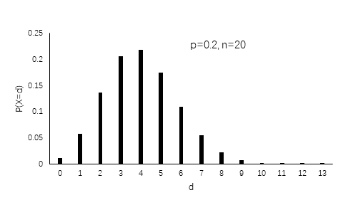
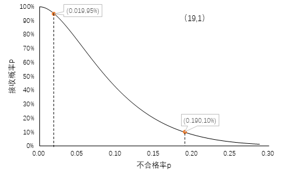
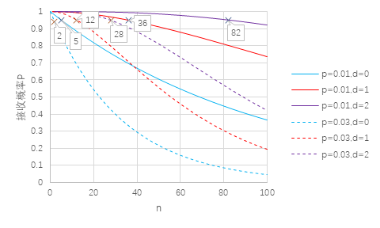

# 异规模出租车企业服务质量公平考核样本量确定方法 
[TOC]
## 1.引言 
出租车作为城市居民出行的一个重要组成部分，是公共交通的一个补充。出租车由于其门对门的运营方式，弥补了常规公共交通通达性不足的缺点，一定程度上抑制了私家车的增长。居民出行对出租车的服务质量要求也越来越高，出租车服务质量也是一个城市展示精神文明建设成果的重要窗口。对出租车行业的第三方质量评估是促进出租车行业发展的重要抓手，课题组与武汉市客运出租汽车管理处合作，作为第三方机构对武汉市57家客运出租车企业共计1万6千余辆车进行服务质量评估。评估形式采取暗访调查形式，即调查员以普通乘客身份乘坐出租汽车，并对车辆和驾驶员服务进行评估。调查为分季度追踪调查，每次调查完成后及时将调查评估结果反馈相关部门。本文立足武汉市出租车行业第三方评估项目，着力于解决第三方评估中各企业抽样样本量的确定问题。 

样本量的确定是抽样调查实施的首要前提，样本量越大，抽样失真的可能性越小，但耗费的人力、物力也越高。相反，如果样本量太小，又会使得抽样误差过大，使得结果失真。因此，在尽可能保证抽样精度的前提下合理压缩抽样成本，是抽样设计的重点。

与常规产品抽样相比较，对出租车企业的抽样还要考虑企业规模的差异，有些大型企业动辄上千辆车，而一些小型企业规模甚至小到二三十辆车。对规模差异如此之大的企业采用同一个抽样标准显然是不合适的，实际操作中一般大型企业的抽样比例小于小型企业。但是，极小规模的企业的抽样比例也不能过大，因为出租车服务质量的抽样采取的事路边扬招方案，抽取到小型企业的难度较大。因此，对异规模的出租车企业质量考核的样本量确认既要平衡经济性和抽样公平性，也要考虑调查实施的易操作性。 

## 2.数据与方法 
### 2.1公平考核样本量 
在出租车服务质量考核中，样本容量的确认是其中一个重要的环节。服务质量的抽查一般采用简单随机抽样，样本量确认公式如（1）式。 
$$
n=\frac{{Z_{\frac{\alpha}{2}}}^{2}\sigma^2}{E^2} 
\tag1
$$
其中：
n：代表所需要的样本量；
Z：某一对应置信水平对应的Z统计量，如95 %置信水平的Z 统计量为1 .96 ,99 %的Z 为2 ；
σ：总体的标准差；
E：容许误差。
按照(1)式，拟定参数进行样本量确定。由于之前没有调查数据，拟定标准差σ取0.5，Z统计量取95%置信水平下，即Z取1.96，容许误差E取5%。
按照式（1）确定的样本量是理论上的样本量，某些情况下可能是不符合实际操作要求的。由于本调查是分季度的多轮长期调查，第一轮调查确定的样本量，其标准差σ取0.5是假设的，在经过第一轮调查后，我们通过对调查结果进行分析，是可以确定各个企业的实际标准差的，通过实际的标准差对初拟的调查样本量进行修正，得到切合各企业规模的简单随机抽样样本量。需要注意的是，这里确定的样本量是满足特定抽样条件下的最小样本量，实际抽样时抽取的样本量必须大于或等于这个样本量。

### 2.2对劣质服务的考核
在出租车服务过程中，有一些让乘客体验十分糟糕的恶劣服务行为，发生这些行为时我们将该次服务称为劣质服务。本文归纳的劣质服务行为有5种，分别是驾驶员拒载乘客、未经乘客同意另载他人、故意绕道行驶、无正当理由终止服务和未按照计价器显示金额收费。这些劣质服务会降低公众对出租车服务行业的印象，进而影响城市精神文明风貌，需要着重关注。服务质量抽查时，出现劣质服务的概率可看作服从二项分布。

二项分布来源于伯努利独立重复试验。即在相同条件下，把一次试验重复进行n次（每次放回抽样）。如果每次试验结果只有互斥的两种，随机变量的概率分布如（2）式，则称其服从二项分布。
$$
P(d)=C_n^d p^d(1-p)^{n-d}\tag2
$$
其中，P表示发生概率，n表示样本量，p表示事件发生的概率。以p=0.2，n=20为例做为说明，图1表示在试验次数为为20，事件发生概率为0.2时不同试验成功次数分别对应的概率值。

图1 二项分布概率密度

将二项分布应用到出租车质量抽检中，则事件发生次数d则为抽检到的劣质服务次数。需要注意的是，若一次服务过程中同时遇到多种恶劣服务行为，也只记为一次恶劣服务。抽样调查得出的次品率可以在一定概率下反映母体的真实次品率。抽样方案的接收概率P可以看作实际质量p的函数。以横坐标表示不合格率p，纵坐标表示接受概率P，可做P~p曲线，这条曲线称为操作特性曲线，即OC曲线。OC曲线的数学表达式如式（3），即用二项分布的累计概率表示抽样中的接收概率。
$$
P\left (x\leqslant  d \right )=  \sum_{x=0}^{d}P_x=\sum_{x=0}^{d}p^x(1-p)^{n-x}\tag3
$$

在同样的抽样方案下，如果不合格率p不同，则接收概率也不同，不合格率越高，接收概率越低。图2为每批抽19个样本，次品数接受数为1时的OC曲线。在95%的接收概率下，其次品率为0.019，在10%的拒收概率下，其次品率为0.19。

图2 OC曲线

由图2可以得出一个明显结论，接受概率与不合格率呈严格的负相关。OC曲线反应了抽样方案对产品质量的辨识度。一个优秀的抽样方案，在不合格率相对较低的情况下，接收概率应该较高；而在不合格率提升到某一较高值时，产品的接收概率应该急剧下降。这样才能做到对高质量产品以大概率接收，对低质量产品以大概率拒收，使得拒收高质量产品或接收低质量产品的风险减到可承受范围。

### 2.3基于劣质服务考核的样本量确定

在实际抽样过程中，在确定抽样方案前，应该对样本的次品率有一个初步的预估，根据可能的次品率和次品数确定抽样规模。即根据式（3），确定次品率p和次品数d，反推出需要抽取的样本数量n。图3反映了在接收概率为95%（一般而言这个标准能较好地达到抽检效果）时，不同的次品率p和次品数d下需要的样本数量。

图3 不同p与d下n的取值

由图3可以直观地看出，在p一定的情况下，d取值越大，最终的n也越大；d一定的情况下，p取值越大，对应的n越小。同样的，这里确定的样本量是满足特定抽样条件下的最小样本量，实际抽样时抽取的样本量必须大于或等于这个样本量。

基于公平原则采取的简单随机抽样方法确定的样本量和基于劣质服务考核确定的样本量都是最小要求样本量，综合考虑二者，应该将两种方法得到的样本量取较大值。

## 3.结果分析

### 3.1简单随机抽样

本次调查